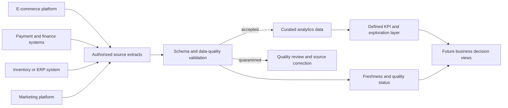

# Phase 2: E-commerce Business Requirements and Data Strategy

## 1. Purpose, product overview, and scope

BizIntel AI is planned as a business-intelligence and decision-support product for small and medium e-commerce businesses. It will turn authorized operational data into transparent KPIs, exploration paths, quality indicators, and eventually forecasts and AI-assisted answers. The product must make weekly trading performance easier to understand without replacing accountable human decisions.

This Phase 2 document is a planning and data-strategy artifact. It specifies the target e-commerce use case and future data contract. It does **not** implement an API, application code, database, machine-learning model, AI assistant, frontend, Docker, cloud deployment, CI/CD, integration, or production dataset.

### Working assumptions to validate

- The initial customer is a direct-to-consumer or omnichannel online retailer of physical products.
- Authorised exports are available for orders, products, customers, refunds, and, when inventory KPIs are used, inventory.
- Each merchant agrees reporting currency, merchant time zone, fiscal calendar, and what constitutes a completed order before results are shown.
- The first users are a small operating team rather than a dedicated data department.

## 2. Target users and personas

| Persona | Primary need | Example decision |
| --- | --- | --- |
| Business owner | Growth, revenue, and operational-risk overview | Change promotion or operating spend |
| E-commerce manager | Channel, campaign, product, and conversion performance | Investigate a declining category or channel |
| Operations/inventory manager | Availability, fulfilment, and return trends | Reorder, transfer, or pause an SKU promotion |
| Finance/operations analyst | Reconciled measures and documented definitions | Validate reported sales against finance source data |

## 3. Business problems, use cases, and questions

### Prioritized use cases

| Priority | Problem | Use case | Intended outcome |
| --- | --- | --- | --- |
| P0 | Metrics are scattered across reports | Unified daily KPI view for sales, orders, customers, refunds, and available inventory | Faster, consistent trading review |
| P0 | Poor performance is found late | Period-over-period movement and exception visibility | Earlier investigation and corrective action |
| P0 | Product/customer contribution is unclear | Product, category, channel, and customer-segment breakdowns | Better merchandising and retention choices |
| P1 | Stockouts and slow sellers are hard to identify | Availability, inventory-cover, and sell-through reporting | Lower lost sales and excess stock |
| P1 | Refunds need manual investigation | Refund/return analysis by product, reason, and channel | Less avoidable return cost and margin leakage |
| P2 | Planning is reactive | Forecasting, anomaly detection, and guided explanations | Better demand and operations planning |
| P2 | Questions require analyst support | Natural-language questions with cited answers | Faster self-service analysis |

P0 is the MVP priority; P1 and P2 are future scope.

### Business questions

- Which products, categories, and channels should be promoted, reviewed, or deprioritized?
- Is sales growth driven by customers, order volume, basket value, or price changes?
- Which SKUs need replenishment attention or are accumulating excess stock?
- Where are cancellations, refunds, returns, or fulfilment problems increasing?
- Which customer segments are valuable or show weakening repeat purchase?
- Is a KPI movement reliable enough to act on, given data freshness and quality status?

## 4. User journeys

### Weekly trading review

1. An owner selects the prior week and compares it with an agreed comparison period.
2. The user reviews net sales, completed orders, average order value, refund rate, and data freshness.
3. A material movement is drilled into by product, category, and channel.
4. The user records a business action, such as reviewing a campaign or replenishing an SKU.
5. The user can trace the metric to contributing source records and quality warnings.

### Inventory exception review

1. An operations manager reviews low inventory cover and stockout-rate measures.
2. The manager filters by location and SKU, where source data supports those dimensions.
3. The user verifies recent demand and stock movement before acting.
4. The action is a reorder, transfer, or promotion change; BizIntel AI remains decision support, not an autonomous purchasing system.

### Refund investigation

1. An e-commerce manager sees an elevated refund rate in a period comparison.
2. The user segments the result by product, channel, and available reason code.
3. The user validates that source data is fresh and complete.
4. The user escalates a product-quality, listing, delivery, or customer-service investigation.

## 5. KPIs and metric definitions

All monetary metrics use the merchant reporting currency. Completed-order metrics exclude returned and cancelled orders unless explicitly stated otherwise.

| KPI | Definition/calculation | Decision use |
| --- | --- | --- |
| Gross merchandise value (GMV) | Sum of quantity × unit list price before discounts, refunds, tax, and shipping | Demand and merchandising trend |
| Net sales | GMV − discounts − refunds; tax/shipping excluded unless configured | Revenue performance and reconciliation |
| Completed orders | Count of unique order IDs in configured completed status | Demand volume |
| Average order value | Net sales / completed orders | Pricing, bundle, and promotion impact |
| Units per order | Units sold / completed orders | Cross-sell opportunity |
| Refund rate | Refund value / GMV | Product/customer-experience risk |
| Repeat purchase rate | Customers with more than one completed order in cohort period / purchasing customers | Retention effectiveness |
| Customer acquisition cost | Attributable marketing spend / new customers; only if spend and attribution exist | Channel efficiency |
| Stockout rate | SKU-days out of stock / active SKU-days | Lost-sales and replenishment risk |
| Inventory cover | Available units / average daily units sold | Reorder planning |
| Sell-through rate | Units sold / (opening units + received units) | Slow-moving stock and excess inventory |

## 6. MVP inclusions and exclusions

### Included in the MVP

- Data profiling and visible quality/freshness status.
- P0 KPIs with date, product/category, channel, and customer-segment views when source data supports them.
- Drill-down from aggregate metrics to contributing orders and products.
- Clear definitions, exclusions, and data-quality notes beside metrics.

### Excluded from the MVP

- Database and persistent data layer implementation.
- ML forecasting, anomaly detection, or recommendations.
- AI assistant and natural-language Q&A.
- Frontend pages, external integrations, authentication, alerting, exports, and multi-user controls.
- Docker, cloud deployment, CI/CD, and fake production data.

### Future scope

P1 adds inventory, return, fulfilment, and marketing-efficiency analysis. P2 adds forecasting, anomaly detection, AI-generated explanations, natural-language questions with evidence citations, integrations, persistent storage, access controls, exports, and scheduled alerts.

## 7. Data requirements and proposed datasets

| Dataset/domain | Purpose | Expected source | MVP status |
| --- | --- | --- | --- |
| Orders and order lines | Sales, discounts, tax, and channel analysis | E-commerce platform | Required |
| Products and variants | Product/category and SKU analysis | E-commerce platform or PIM | Required |
| Customers | Counts, cohorts, and repeat purchase | E-commerce platform | Required; pseudonymized IDs preferred |
| Payments, refunds, cancellations | Net-sales reconciliation and refund metrics | Payment provider and e-commerce platform | Required |
| Inventory snapshots/movements | Availability, cover, stockout | ERP or inventory system | Required only for inventory KPIs |
| Marketing spend/attribution | CAC and channel efficiency | Marketing platform | Optional; required only for CAC |
| Fulfilment and returns | Delivery and return-reason analysis | ERP or fulfilment provider | Future/P1 |

### Source assumptions

Source exports must be authorised for business use. Each source has an accountable owner, stable identifiers, and sufficient history for agreed reporting periods. Settlement timing may differ from order timing. Attribution model/lookback window, accounting periods, tax treatment, and currency-conversion source and date convention must be documented.

## 8. Proposed data schema, entities, and relationships

This is a logical schema, not a database design. Timestamps are stored in UTC; merchant reporting time zone is configuration. Monetary values are decimals in transaction currency, with reporting-currency values only when conversion is necessary.

### `orders`

| Field | Type | Required | Rule |
| --- | --- | --- | --- |
| `order_id` | string | Yes | Unique, immutable source identifier |
| `customer_id` | string | Yes* | Pseudonymized ID; nullable only for genuine guest checkout |
| `ordered_at` | timestamp | Yes | UTC creation time |
| `status` | enum | Yes | Map source state to `pending`, `completed`, `cancelled`, or `refunded` |
| `sales_channel` | string | Yes | Web, marketplace, retail, or mobile app |
| `currency_code` | ISO 4217 string | Yes | Three-letter transaction currency |
| `subtotal_amount` | decimal | Yes | Merchandise before order-level discount/tax |
| `discount_amount` | decimal | Yes | Non-negative value |
| `tax_amount` | decimal | Yes | Non-negative value |
| `shipping_amount` | decimal | Yes | Non-negative value |
| `total_amount` | decimal | Yes | Charged transaction total |

### `order_lines`

| Field | Type | Required | Rule |
| --- | --- | --- | --- |
| `order_line_id` | string | Yes | Unique, immutable source line ID |
| `order_id` | string | Yes | Foreign key to `orders.order_id` |
| `product_id` | string | Yes | Foreign key to product/SKU |
| `quantity` | integer | Yes | Positive whole number for a sale line |
| `unit_list_price` | decimal | Yes | Pre-discount unit price |
| `unit_discount_amount` | decimal | Yes | Non-negative discount per unit |
| `line_net_amount` | decimal | Yes | Amount after discounts, before tax/shipping |

### `products`

| Field | Type | Required | Rule |
| --- | --- | --- | --- |
| `product_id` | string | Yes | Unique product/SKU identifier |
| `sku` | string | Yes | Unique among active variants |
| `product_name` | string | Yes | Human-readable name |
| `category` | string | Yes | Current category; history needs later effective dating |
| `unit_cost_amount` | decimal | No | Commercially sensitive optional landed cost |
| `active` | boolean | Yes | Current sellability indicator |

### `customers`

| Field | Type | Required | Rule |
| --- | --- | --- | --- |
| `customer_id` | string | Yes | Stable pseudonymized identifier; no email/phone required |
| `first_ordered_at` | timestamp | No | First completed order if source supplies it |
| `country_code` | ISO 3166-1 alpha-2 | No | Only where needed for analysis |
| `marketing_consent` | boolean | No | Source-provided consent status |

### `refunds`

| Field | Type | Required | Rule |
| --- | --- | --- | --- |
| `refund_id` | string | Yes | Unique refund ID |
| `order_id` | string | Yes | Foreign key to order |
| `order_line_id` | string | No | Use when attributable to a line |
| `refunded_at` | timestamp | Yes | UTC refund time |
| `refund_amount` | decimal | Yes | Positive and not greater than eligible balance |
| `reason_code` | string | No | Normalized source reason |

### `payment_transactions`

| Field | Type | Required | Rule |
| --- | --- | --- | --- |
| `payment_transaction_id` | string | Yes | Unique provider transaction identifier |
| `order_id` | string | Yes | Foreign key to `orders.order_id` |
| `transaction_type` | enum | Yes | `authorization`, `capture`, `refund`, `chargeback`, or `fee` |
| `status` | enum | Yes | Provider status mapped to documented canonical values |
| `transacted_at` | timestamp | Yes | UTC provider transaction time |
| `amount` | decimal | Yes | Signed or explicitly typed amount; convention must be consistent per source |
| `currency_code` | ISO 4217 string | Yes | Three-letter transaction currency |
| `settlement_id` | string | No | Provider settlement/batch reference for finance reconciliation |

### `inventory_snapshots`

| Field | Type | Required | Rule |
| --- | --- | --- | --- |
| `snapshot_at` | timestamp | Yes | UTC snapshot time |
| `product_id` | string | Yes | Foreign key to product |
| `location_id` | string | No | Warehouse, store, or fulfilment site |
| `on_hand_units` | integer | Yes | Physical units; negative only with documented source behavior |
| `reserved_units` | integer | Yes | Units allocated to open orders |
| `available_units` | integer | Yes | Expected to equal on hand − reserved where supported |

Relationships are: one customer to many orders; one order to many order lines; one product to many order lines and inventory snapshots; one order to many payment transactions and refunds; and, where present, one order line to many line-level refunds.

## 9. Data ingestion strategy

The future ingestion approach should preserve an immutable source extract and a validated, curated analytics representation. Each source delivery should have a source name, extraction time, source-reporting period, schema version, checksum or equivalent integrity marker, record count, and load status. Initial ingestion should favor repeatable CSV or platform-report extracts; later API connections are future scope.

Future loads should be idempotent using source IDs plus source-update timestamps where reliable. Corrections must be traceable: do not overwrite business history without retaining source provenance and load version. Quarantined records should be reviewable and must not silently affect financial KPIs.

## 10. Data-quality requirements and validation

| Rule | Validation expectation | Handling |
| --- | --- | --- |
| Identifier uniqueness | Primary IDs are unique in their domain | Reject duplicates or quarantine for source resolution |
| Referential integrity | Lines, refunds, and inventory records reference valid parents | Quarantine orphans; exclude from KPIs |
| Required fields/types | Required values are present and parse correctly | Reject/quarantine affected records |
| Status mapping | Source statuses map to canonical values | Flag unmapped statuses; exclude from completed-order KPI |
| Temporal validity | Timestamps parse as UTC and fall in reporting window | Flag invalid/future records |
| Monetary validity | Decimal/currency valid; refunds do not exceed eligible value | Quarantine inconsistent records |
| Quantity validity | Sale quantities are positive integers | Reject invalid sales lines |
| Reconciliation | Orders reconcile to lines, discounts, tax, shipping within agreed rounding tolerance | Flag discrepancy beside the order |
| Freshness | Delivery meets daily/weekly cadence | Show stale-data warning and last-successful time |

Every future load should publish received, accepted, quarantined, duplicate, null-rate, schema-version, freshness, and reconciliation results. Financial values must not be silently imputed.

### Missing data

Required fields are not imputed for financial, order, product-ID, or time fields: affected records are quarantined. Optional dimensions use an explicit `unknown` category only when the absence is meaningful and disclosed. A KPI must display its missing-data coverage and should not be shown if a critical input is unavailable.

### Duplicate data

Deduplicate by immutable source ID. If a source reissues a corrected record, retain provenance and select the newest valid version according to documented source-update timestamp rules. Conflicting duplicates without a reliable precedence rule are quarantined.

### Outliers

Outliers are not automatically deleted. Examples include unusually high order values, refund totals, unit quantities, and sudden inventory movement. Flag values against documented statistical and business thresholds; verify against source data; retain confirmed valid outliers because they may represent real business events.

## 11. Privacy, security, and ethical considerations

- Minimize data: never ingest card numbers, credentials, passwords, or unnecessary direct identifiers.
- Prefer pseudonymous customer IDs; retain email, phone, and full addresses only for approved, access-controlled needs.
- Apply role-based access, audit trails, encryption in transit/at rest, and environment-based secret management when implementation begins.
- Define retention, deletion, and data-subject request processes for applicable law and merchant obligations.
- Show definitions, exclusions, freshness, and uncertainty to avoid misleading decisions.
- Review future segmentation and recommendations for unfair treatment, proxy discrimination, or unsupported causal claims.
- Future AI output must preserve access controls, cite evidence, and remain decision support rather than autonomous decision-making.

## 12. Success metrics

### Business/product success

| Measure | Phase 2 target | Future product measure |
| --- | --- | --- |
| Definition coverage | P0 KPI definitions reviewed with target business | At least 90% of reported KPIs have owner-approved definitions |
| Data readiness | Fields, owners, sources, and rules documented | At least 95% of accepted records pass critical validation |
| Reconciliation | Method and tolerance agreed | Net sales within agreed tolerance of finance source |
| Decision usefulness | Stakeholders validate P0 use cases | Weekly review completed without a manual KPI workbook |
| Time to insight | Current workflow understood | Reduced time from data availability to review |

### Later ML success metrics

ML is out of scope for the MVP. Future forecasting evaluation should use a time-based holdout, a naive seasonal baseline, and metrics appropriate to the target: MAE, RMSE, and weighted absolute percentage error for demand/sales; forecast-interval coverage for uncertainty; and precision, recall, alert rate, and investigation usefulness for anomaly detection. Evaluation must be segmented by SKU/channel and compared against baseline planning value.

### Later AI assistant success criteria

AI is out of scope for the MVP. Future evaluation must require source-grounded answers with citations, correct metric definitions, authorization-aware data access, abstention where evidence is missing, response usefulness verified by representative business users, and monitoring for unsupported claims, privacy leakage, and harmful recommendations.

## 13. High-level future data flow and architecture



The existing architecture notes describe a future FastAPI backend, separate business/analytics logic, later PostgreSQL storage, and a later React/Next.js frontend. Phase 2 is consistent with those boundaries: this document adds a logical data contract only. No conflict was identified. The following is the future high-level system separation:

```text
Source exports/integrations
        |
Validation and quality reporting
        |
Curated data layer (future persistence)
        |
Business and analytics logic (separate from HTTP/UI)
        |
Future FastAPI API ----> Future React/Next.js UI
        |
Future ML and AI decision-support capabilities
```

## 14. Risks, assumptions, and open questions

### Risks

- Source data may not contain stable IDs, granular refunds, accurate inventory, or enough history for the intended KPIs.
- Metric definitions may differ between e-commerce, payment, and finance systems.
- Marketing attribution may not support reliable CAC claims.
- Incomplete consent/governance information may constrain customer analysis.
- Later forecasts or AI answers could be over-trusted without quality and evidence controls.

### Open questions for Phase 3 planning

1. Which e-commerce platform and export formats will be supported first?
2. What exact status map defines completed, cancelled, partially refunded, and fully refunded orders?
3. What financial reconciliation tolerance, period boundary, tax, and shipping treatment does the merchant approve?
4. Which inventory locations and reservations should be included in availability?
5. Is product cost available and authorized for margin metrics?
6. Which customer fields are necessary, and what local privacy obligations apply?
7. What reporting cadence, historical lookback, retention period, and correction policy are required?
8. Which user roles need access to commercially sensitive cost or customer data?

Phase 2 is complete only after the target business reviews and resolves the applicable assumptions and open questions before Phase 3 data-layer design.